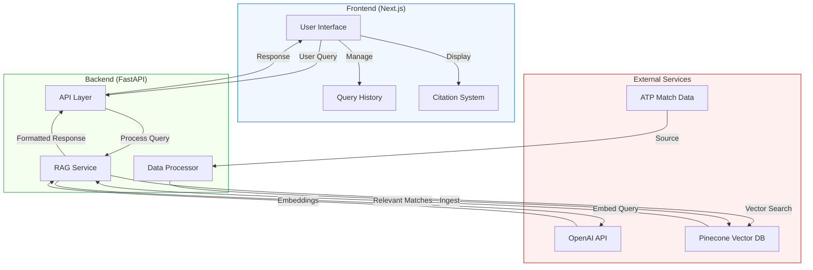

# TennisTorch 🎾

TennisTorch is an AI-powered tennis history answer engine that illuminates insights and answers questions about tennis matches and statistics from the Open Era. It intelligently retrieves and cites from every single professional match record from 1968-2024. The platform features a beautiful, modern interface with real-time semantic search capabilities.

## Features

- 🤖 AI-powered natural language interface for tennis queries
- 📊 Comprehensive ATP match data from the Open Era
- 🔍 Semantic search with citation to actual match records
- 🏆 Detailed tournament and match information
- 🎾 Surface-specific styling and match context
- 📜 Query history with quick access to previous searches
- 🔗 Shareable query URLs that persist across page refreshes
- ⚡ Real-time updates and responsive design

## Tech Stack

### Frontend
- Next.js 14 with App Router
- TailwindCSS for styling
- Lucide icons
- Modern UI components with tennis-themed design
- Responsive and accessible interface

### Backend
- FastAPI for the REST API
- OpenAI's GPT models for natural language processing
- Pinecone for vector similarity search
- Python for data processing and analysis

## System Architecture



## Prerequisites

- Python 3.8+
- Node.js 16+
- npm or yarn
- OpenAI API key
- Pinecone API key

## Project Structure

```
tennistorch/
├── backend/                # FastAPI backend
│   ├── app/
│   │   ├── api/           # API endpoints and routing
│   │   ├── services/      # Business logic and services
│   │   ├── data/          # Data processing and management
│   │   ├── utils/         # Utility functions and helpers
│   │   └── main.py        # Application entry point
│   ├── scripts/           # Data ingestion scripts
│   └── requirements.txt   # Python dependencies
│
├── frontend/              # Next.js frontend
│   ├── src/
│   │   ├── app/          # Next.js 14 app directory
│   │   ├── components/   # Reusable React components
│   │   └── types/        # TypeScript type definitions
│   ├── public/           # Static assets
│   ├── package.json      # Node.js dependencies
│   └── tailwind.config.js # Tailwind CSS configuration
│
└── README.md             # Project documentation
```

## Local Development Setup

### Backend Setup

1. Navigate to the backend directory:
```bash
cd backend
```

2. Create and activate a virtual environment:
```bash
python -m venv venv
source venv/bin/activate
```

3. Install dependencies:
```bash
pip install -r requirements.txt
```

4. Copy `.env.example` to `.env` in the backend directory and fill in your values:
```bash
cp .env.example .env
```

Required environment variables:
```
OPENAI_API_KEY=your_openai_api_key
PINECONE_API_KEY=your_pinecone_api_key
PINECONE_ENVIRONMENT=your_pinecone_environment
PINECONE_INDEX_NAME=your_pinecone_index_name
```

### Data Ingestion

The system uses ATP tennis match data for analysis. To ingest the data:

1. Navigate to the backend directory:
```bash
cd backend
```

2. Ensure your virtual environment is activated and run:
```bash
python scripts/ingest_atp_data.py
```

This script will:
- Download the ATP tennis match dataset from Jeff Sackmann's repository
- Process and clean the match data
- Create vector embeddings for semantic search
- Store the embeddings in your Pinecone vector database

The ingestion process might take 15-30 minutes depending on your system. Progress will be displayed in the console.

### Frontend Setup

1. Navigate to the frontend directory:
```bash
cd frontend
```

2. Install dependencies:
```bash
npm install
# or
yarn install
```

3. Copy `.env.example` to `.env.local` and update the values:
```bash
cp .env.example .env.local
```

For local development, use:
```
NEXT_PUBLIC_API_URL=http://localhost:8000
```

## Running Locally

### Start the Backend

1. From the backend directory with your virtual environment activated:
```bash
python -m uvicorn app.main:app --reload --port 8000
```
The backend will be available at `http://localhost:8000`

2. Verify the backend is running by visiting:
- `http://localhost:8000/docs` - API documentation
- `http://localhost:8000/health` - Health check endpoint

### Start the Frontend

1. From the frontend directory:
```bash
npm run dev
# or
yarn dev
```
The frontend will be available at `http://localhost:3000`


## Deployment

### Backend Deployment (Vercel)

1. Create a new project on Vercel
2. Connect your GitHub repository
3. Set the following configuration:
   - Framework Preset: Other
   - Root Directory: `backend`
   - Build Command: `pip install -r requirements.txt`
   - Output Directory: `.`
   - Install Command: `pip install -r requirements.txt`


4. Add the following environment variables in Vercel:
   ```
   OPENAI_API_KEY=your_openai_api_key
   PINECONE_API_KEY=your_pinecone_api_key
   PINECONE_ENVIRONMENT=your_pinecone_environment
   PINECONE_INDEX_NAME=your_pinecone_index_name
   ```

### Frontend Deployment (Vercel)

1. Create a new project on Vercel
2. Connect your GitHub repository
3. Set the following configuration:
   - Framework Preset: Next.js
   - Root Directory: `frontend`


4. Add the following environment variables in Vercel:
   ```
   NEXT_PUBLIC_API_URL=your_backend_url
   ```

## Development Notes
- The backend uses FastAPI's automatic API documentation. Visit `/docs` to explore available endpoints
- The tennis data is sourced from [Jeff Sackmann's tennis_atp repository](https://github.com/JeffSackmann/tennis_atp)
- Vector embeddings are created using OpenAI's text-embedding-ada-002 model
- The frontend is built with Next.js 14 and uses the App Router

## Demo Video

Watch the demo video to see TennisTorch in action:

[](https://youtu.be/2Geyjy1XnjA)
